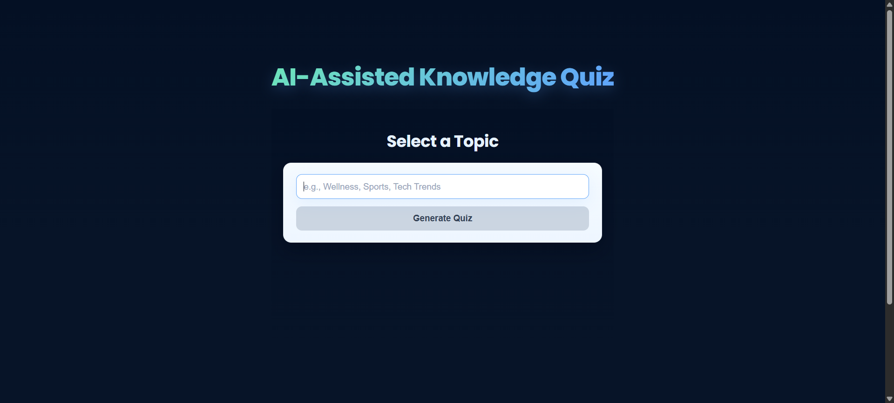
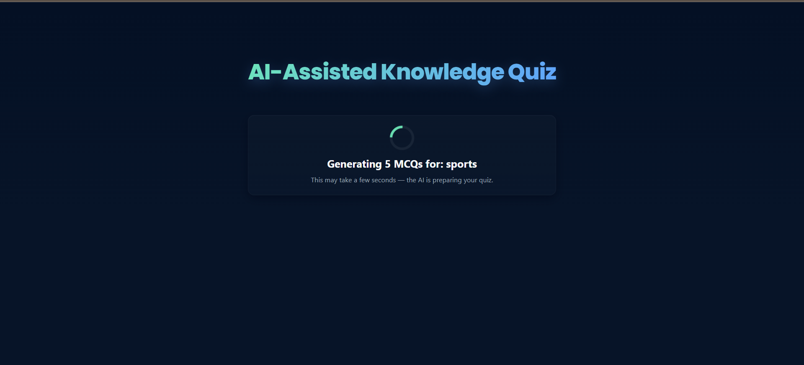
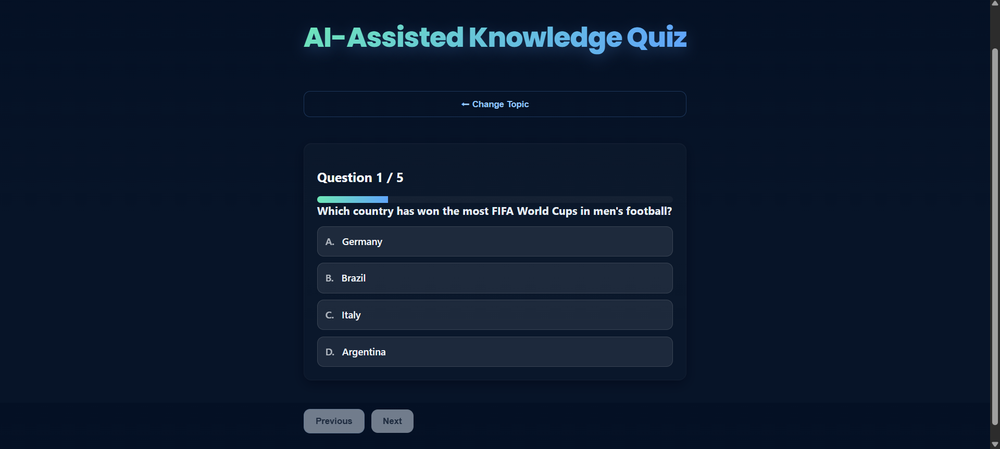
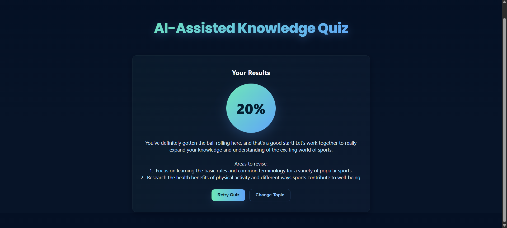

# AI-Assisted Knowledge Quiz

## 1. Project Setup & Demo

### Web
To run the project locally:

```bash
npm install
npm start
```

Access the application at:
`http://localhost:3000`

### Mobile (If Required)
(Not applicable for this project, but included as per template.)

- **iOS:** Open in Xcode → Run on simulator/device  
- **Android:** Run `./gradlew assembleDebug` or launch from Android Studio  

### Demo
Attach either:

- A **screen recording** demonstrating all four screens, or  
- A **hosted link** (Vercel/Netlify)  

---

## 2. Problem Understanding

The goal is to build an **AI-powered quiz generator** that accepts any user-provided topic and returns a structured, navigable 4-step quiz experience.

### Key Requirements
- User enters a topic  
- AI generates **exactly 5 MCQs** with:
  - question text  
  - 3–4 options  
  - correct answer index (0-based)  
- Quiz is displayed one question at a time  
- Track user selections + score  
- Final screen displays AI-generated personalized feedback  
- Must handle malformed JSON and retry  

### Assumptions
- AI may return inconsistent JSON → validation needed  
- UI should be clean, modern, and responsive  

---

## 3. AI Prompts & Iterations

### MCQ Generation Prompt
The application sends a structured prompt:

- Output must be **strict JSON**  
- 5 questions  
- Options array with 3–4 values  
- `answer` must be a number (0-based)  
- No additional explanation text  

### Retry Handling
If parsing fails:

1. Attempt to parse and sanitize  
2. Retry API call  
3. After 3 failed attempts → show error (`Failed to Generate`)  

### Feedback Prompt
Given:
- Topic  
- Score percentage  

AI returns:
- Short performance summary  
- Two improvement suggestions  

### Iterations
- Adjusted prompts for reliable JSON formatting  
- Added aggressive cleanup for malformed responses  
- Enforced strict structure to maintain consistency  

---

## 4. Architecture & Code Structure

### Navigation Flow

```
TopicChoose → GenerateScreen → QuizScreen → ResultScreen
```

### Component Responsibilities

- **TopicChoose**  
  Accept topic input from user.

- **GenerateScreen**  
  Trigger AI quiz generation, show loading state, handle retries.

- **QuizScreen**  
  Display MCQs one-by-one, handle user selections, maintain progress bar.

- **ResultScreen**  
  Compute score and generate personalized feedback via AI.

### AI Service (`aiService.ts`)
Handles:
- Prompt construction  
- Gemini API calls  
- JSON parsing  
- Retry logic  
- Returning sanitized quiz objects  

### Folder Structure
```
src/
  components/
    TopicChoose.tsx
    GenerateScreen.tsx
    QuizScreen.tsx
    ResultScreen.tsx

  aiService.ts
  App.tsx
  App.css

public/
  screenshots/
```

### State Management
- React `useState` for local UI state  
- Props for data flow between components  

---

## Screenshots

### 1. Topic Selection


### 2. Quiz Generation (AI Loading)


### 3. Quiz Interface


### 4. Result & AI Feedback



## 6. Known Issues / Improvements

### Known Issues
- AI may sometimes produce subtle JSON format issues  
- No detailed explanations for correct answers  
- Limited navigation (linear experience)

### Improvements
- Add answer explanations  
- Add difficulty selection  
- Add countdown timer  
- Save quiz history using localStorage  
- Add animations for transitions  
- Add JSON schema validation  

---

## 7. Bonus Work

- Implemented **robust retry mechanism** for malformed AI JSON  
- Modern gradient UI with responsive layout  
- Added progress tracking and intuitive navigation  
- Clean separation of UI, logic, and AI services  
- Personalized AI feedback system  
